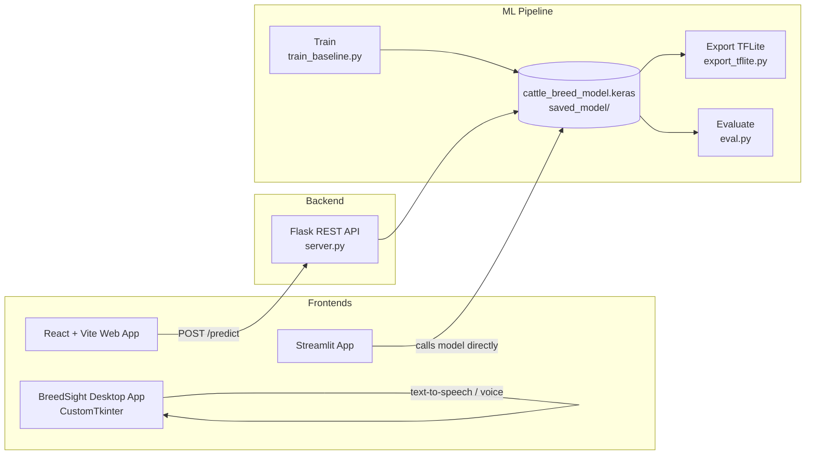
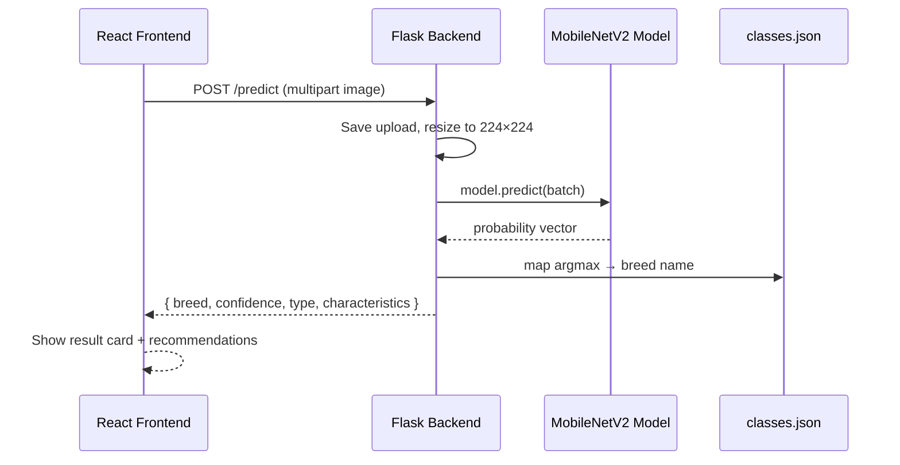

<div align="center">

# 🐄 Cattle Breed Recognition

**AI-powered cattle & buffalo breed identification system** for Indian dairy farmers

TensorFlow · Flask · React · Streamlit · Python Desktop

[](https://python.org)
[](https://tensorflow.org)
[](https://react.dev)
[](https://flask.palletsprojects.com)
[](https://streamlit.io)
[](https://vitejs.dev)
[](#-multi-language-support)
[]()

</div>

A complete, end-to-end system that **recognizes cattle and buffalo breeds from a photo** using a fine-tuned **MobileNetV2** deep-learning model. It ships with four interchangeable front-ends:

- 🌐 **React + Vite web app** — modern, mobile-friendly UI (shadcn/ui + Tailwind)
- 💻 **Python desktop app** (BreedSight AI) — CustomTkinter GUI with **voice commands & text-to-speech**
- 📊 **Streamlit app** — quick web demo
- 🐍 **Flask REST API** — the shared inference backend

---

## ✨ Features

- 🔍 **AI Breed Recognition** — identifies 15 cattle & buffalo breeds from a photo with a confidence score
- 🎙️ **Voice Input & Text-to-Speech** — hands-free usage for farmers (desktop app)
- 🌍 **Multi-Language UI** — English, हिंदी (Hindi), मराठी (Marathi)
- 🏥 **Health Analysis** — condition risk assessment (FMD, mastitis, tick infestation, nutrition)
- 🥛 **Milk Yield Analysis** — compare current vs expected yield with feeding recommendations
- 📱 **Responsive Design** — beautiful, farmer-friendly UI with 3D effects
- 🧠 **Transfer Learning** — MobileNetV2 (ImageNet) + fine-tuning with data augmentation
- 📦 **Model Export** — `.keras`, `.h5` and quantized **TFLite** (float16 / int8)

---

## 🏗️ System Architecture



**Inference flow:**



---

## 🗂️ Project Structure (Important Files)

```
cattle-breed-recognition/
│
├── train_baseline.py          # ★ Training pipeline (MobileNetV2 + fine-tuning)
├── eval.py                    # ★ Model evaluation → confusion matrix + metrics
├── export_tflite.py           # ★ Export to .tflite (float16 / int8 quantization)
├── server.py                  # ★ Flask REST API for breed prediction
├── streamlit_app.py           # ★ Streamlit web demo
│
├── cattle_breed_model.keras   # Production model used by server.py
│
├── saved_model/
│   └── breed_classifier/      # ★ All trained checkpoints & labels
│       ├── classes.json       #    15 breed labels (order = model output)
│       ├── best_model.h5
│       ├── best_model_finetuned.h5
│       ├── best_model_finetuned.keras
│       └── app.py             #    Standalone Flask inference server
│
├── eval_results/              # Evaluation outputs
│   ├── metrics.txt
│   ├── confusion_matrix.csv
│   └── class_names.csv
│
├── src/                       # ★ React/Vite frontend + Python desktop app
│   ├── App.tsx                #    Main app (screen router)
│   ├── components/
│   │   ├── screens/           #    Home, Voice, Detection, Health, Milk Yield
│   │   └── ui/                #    shadcn/ui components
│   ├── data/                  #    breeds.ts, health.ts
│   ├── contexts/              #    Multi-language context
│   ├── main.py                #    BreedSight AI desktop app (CustomTkinter)
│   ├── setup.py               #    Desktop app installer
│   └── packages.json + vite   #    Build config
│
├── resized.py                 # Image augmentation utility
├── requirements.txt           # Python dependencies
└── package.json               # Frontend dependencies
```

> ⭐ marked files are the most important entry points.

---

## 🚀 Getting Started

### 1. Clone & install Python deps

```bash
git clone https://github.com/krushna1845-lab/Cattle-Breed-Recognition.git
cd cattle-breed-recognition

python -m venv venv
venv\Scripts\activate            # Windows
source venv/bin/activate         # Linux/macOS

pip install -r requirements.txt
```

### 2. Start the Flask backend

```bash
python server.py                 # http://127.0.0.1:5000
```

### 3. Start the React frontend

```bash
npm install
npm run dev                      # http://localhost:5173
```

Upload a cattle/buffalo photo in the web app and get the breed + confidence instantly.

### 4. Other front-ends

| App | Command | Notes |
|-----|---------|-------|
| 🌐 React web app | `npm run dev` | Requires Flask backend running |
| 📊 Streamlit demo | `streamlit run streamlit_app.py` | Loads model locally (or `MODEL_URL` from secrets) |
| 💻 Desktop app | `cd src && python setup.py && python main.py` | Voice + TTS, offline-capable |

---

## 🧠 Training the Model

Run the full training pipeline (expects the dataset under `dataset/train`, `dataset/val`, `dataset/test`):

```bash
python train_baseline.py
```

**Pipeline overview:**

1. **Load data** — `image_dataset_from_directory`, 224×224, batch 32, cached + prefetched
2. **Augment** — random flip, rotation, zoom, contrast, translation
3. **Base transfer learning** — MobileNetV2 (frozen, ImageNet weights) + GAP + Dropout → softmax
4. **Fine-tuning** — unfreeze top 25% layers, LR `1e-5`
5. **Callbacks** — `ModelCheckpoint`, `EarlyStopping`, `ReduceLROnPlateau`
6. **Artifacts** — saves `best_model_finetuned.keras` and the production `cattle_breed_model.keras`

### Evaluate

```bash
python eval.py
```

Writes `metrics.txt`, `confusion_matrix.csv`, and `class_names.csv` into `eval_results/`.

### Export to TFLite (edge devices)

```bash
# float32
python export_tflite.py

# float16 quantization
python export_tflite.py --quantize --quant_type float16

# int8 quantization (needs representative data dir)
python export_tflite.py --quantize --quant_type int8 --data_dir /path/to/dataset
```

---

## 🔌 API Reference

### `POST /predict`

Upload an image (multipart `file` field).

**Request**

```bash
curl -X POST http://127.0.0.1:5000/predict \
  -F "file=@cow.jpg"
```

**Response**

```json
{
  "breed": "Gir",
  "breed_name": "Gir",
  "confidence": 96.4,
  "type": "cattle",
  "characteristics": [
    "High milk yield",
    "Disease resistant",
    "Adaptable to local climate"
  ]
}
```

The model expects raw `[0, 255]` pixels — preprocessing (`mobilenet_v2.preprocess_input`) is handled inside the model graph.

---

## 🐄 Supported Breeds

| Type | Breeds |
|------|--------|
| 🐂 Cattle | Ayrshire, Brown Swiss, Gir, Holstein Friesian, Jersey, Krishna Valley, Ongole, Rathi, Red Sindhi, Sahiwal, Tharparkar, Toda, Vechur |
| 🐃 Buffalo | Banni, Bhadawari |

---

## 🌾 Multi-Language Support

- **English** — full interface + voice commands
- **हिंदी (Hindi)** — complete Hindi UI
- **मराठी (Marathi)** — complete Marathi UI

Voice commands (desktop): `"Take photo"`, `"Health report"`, `"Milk yield analysis"`, `"Change language to Hindi"`, `"Go back"`, and more.

---

## 🛣️ Roadmap

- [x] MobileNetV2 transfer-learning baseline
- [x] Base + fine-tuning training pipeline
- [x] Flask prediction API
- [x] React web frontend (multi-screen)
- [x] Multi-language support (EN/HI/MR)
- [x] TFLite export (float16 / int8)
- [ ] Improve test-set accuracy & expand dataset
- [ ] Model serving via TFLite on mobile
- [ ] SQLite persistence for farm records
- [ ] Web-cam capture in web app
- [ ] Region/weather-aware health recommendations

---

## 🤝 Contributing

1. Fork the repo
2. Create a branch: `git checkout -b feature/amazing-feature`
3. Commit: `git commit -m 'Add amazing feature'`
4. Push & open a Pull Request

Good areas: **accuracy improvements**, **more translations**, **mobile port**, **better dataset**, **tests**.

---

## 📄 License

MIT — see [LICENSE](LICENSE).

---

<div align="center">

**Made for farmers and livestock enthusiasts** 🐮

[⭐ Star this repo](https://github.com/krushna1845-lab/Cattle-Breed-Recognition) · [🐛 Report a bug](https://github.com/krushna1845-lab/Cattle-Breed-Recognition/issues)

</div>